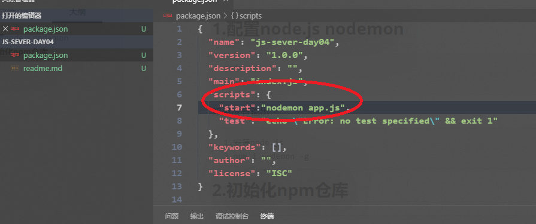

## 1.配置node.js nodemon

```
node -v
nodemon -v
```

如果没有输出

```
1.安装node.js
2.npm i nodemon -g
```

## 2.初始化npm仓库

```
npm init -y
```


## 3.配置package.json文件




## 4.安装koa

```
npm i koa  koa-router -S
```

